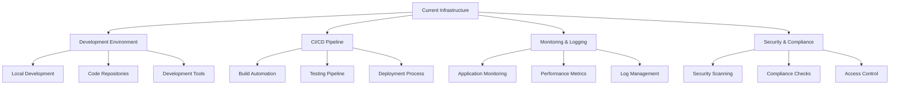
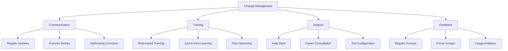

# The Three-Step ASDM Implementation Guide

*Published on December 20, 2024 by David Kim • 10 min read*

---

## A Comprehensive Walkthrough of the ASDM Methodology

Implementing AI-powered System Development Methodology (ASDM) in your organization requires a structured, phased approach. This comprehensive guide walks you through the three essential phases: Assessment & Planning, Foundation Setup, and Implementation & Scaling. Each phase builds upon the previous one, ensuring a smooth transition to AI-first development practices.

## Why a Phased Approach?

Transforming development methodologies is complex and risky. A phased approach offers several advantages:

- **Reduced Risk**: Gradual implementation allows for course correction
- **Learning Opportunities**: Each phase provides insights for the next
- **Change Management**: Teams can adapt gradually to new processes
- **Measurable Progress**: Clear milestones and success metrics
- **Resource Optimization**: Spread costs and effort over time

## Phase 1: Assessment & Planning (Weeks 1-4)

The foundation of successful ASDM implementation lies in thorough assessment and strategic planning.

### 1.1 Current State Analysis

#### **Development Process Audit**

Begin by documenting your current development processes:

```yaml
# Current State Assessment Template
development_lifecycle:
  planning:
    tools: [Jira, Confluence, Miro]
    duration: "2-3 weeks per epic"
    pain_points: ["Requirements ambiguity", "Estimation accuracy"]
  
  development:
    languages: [Java, Python, JavaScript]
    frameworks: [Spring Boot, React, Node.js]
    tools: [IntelliJ, VS Code, Git]
    pain_points: ["Code review bottlenecks", "Technical debt"]
  
  testing:
    types: [Unit, Integration, E2E]
    automation_level: "60%"
    tools: [JUnit, Selenium, Jest]
    pain_points: ["Flaky tests", "Slow feedback loops"]
  
  deployment:
    strategy: "Blue-green deployment"
    frequency: "Weekly releases"
    tools: [Jenkins, Docker, Kubernetes]
    pain_points: ["Manual deployment steps", "Rollback complexity"]
```

#### **Team Skills Assessment**

Evaluate your team's readiness for AI integration:

**Technical Skills Inventory**:
- Programming language proficiency
- Familiarity with AI/ML concepts
- Experience with automation tools
- Cloud platform knowledge

**Soft Skills Evaluation**:
- Adaptability to new technologies
- Collaboration and communication
- Problem-solving approaches
- Learning agility

#### **Infrastructure Evaluation**

Assess your current technical infrastructure:



### 1.2 AI Integration Opportunities

#### **High-Impact Areas Identification**

Identify areas where AI can provide immediate value:

**Code Generation & Completion**
- Boilerplate code reduction: 70% time savings
- API endpoint generation: 50% faster development
- Test case creation: 80% coverage improvement

**Quality Assurance**
- Automated code review: 60% faster reviews
- Bug prediction: 40% reduction in production issues
- Security vulnerability detection: 90% coverage

**DevOps & Monitoring**
- Automated deployment decisions: 30% faster releases
- Predictive scaling: 25% cost reduction
- Incident response: 50% faster resolution

#### **ROI Analysis**

Calculate potential return on investment:

```python
# ROI Calculation Example
def calculate_ai_roi(current_metrics, projected_improvements):
    """
    Calculate ROI for AI implementation
    """
    current_cost = {
        'development_time': current_metrics['dev_hours'] * current_metrics['hourly_rate'],
        'bug_fixing': current_metrics['bug_hours'] * current_metrics['hourly_rate'],
        'deployment_time': current_metrics['deploy_hours'] * current_metrics['hourly_rate']
    }
    
    improved_cost = {
        'development_time': current_cost['development_time'] * (1 - projected_improvements['dev_efficiency']),
        'bug_fixing': current_cost['bug_fixing'] * (1 - projected_improvements['bug_reduction']),
        'deployment_time': current_cost['deployment_time'] * (1 - projected_improvements['deploy_efficiency'])
    }
    
    annual_savings = sum(current_cost.values()) - sum(improved_cost.values())
    implementation_cost = projected_improvements['ai_tools_cost'] + projected_improvements['training_cost']
    
    roi = (annual_savings - implementation_cost) / implementation_cost * 100
    payback_period = implementation_cost / (annual_savings / 12)  # months
    
    return {
        'annual_savings': annual_savings,
        'roi_percentage': roi,
        'payback_months': payback_period
    }
```

### 1.3 Strategic Planning

#### **Implementation Roadmap**

Create a detailed roadmap with clear milestones:

**Quarter 1: Foundation**
- Week 1-4: Assessment & Planning
- Week 5-8: Tool selection and procurement
- Week 9-12: Infrastructure setup

**Quarter 2: Pilot Implementation**
- Week 13-16: Team training and onboarding
- Week 17-20: Pilot project execution
- Week 21-24: Results analysis and refinement

**Quarter 3-4: Scaling**
- Week 25-36: Gradual rollout to all teams
- Week 37-48: Optimization and advanced features

#### **Success Metrics Definition**

Establish clear, measurable success criteria:

**Productivity Metrics**:
- Development velocity (story points/sprint)
- Time to market (feature delivery time)
- Code review turnaround time
- Deployment frequency

**Quality Metrics**:
- Bug density (bugs per KLOC)
- Production incident frequency
- Security vulnerability count
- Technical debt ratio

**Team Satisfaction**:
- Developer satisfaction scores
- Tool adoption rates
- Learning curve metrics
- Retention rates

## Phase 2: Foundation Setup (Weeks 5-16)

This phase focuses on establishing the technical and organizational foundation for AI-powered development.

### 2.1 Infrastructure Preparation

#### **AI-Ready Architecture**

Design systems that can effectively leverage AI:

```yaml
# AI-Ready Architecture Components
data_layer:
  - structured_logging: "Enable AI analysis of logs"
  - metrics_collection: "Comprehensive performance data"
  - code_metadata: "Semantic information for AI tools"

api_layer:
  - standardized_apis: "Consistent interfaces for AI integration"
  - webhook_support: "Real-time AI notifications"
  - rate_limiting: "Protect against AI tool overuse"

security_layer:
  - api_key_management: "Secure AI tool authentication"
  - data_privacy: "Protect sensitive information"
  - audit_logging: "Track AI tool usage"
```

#### **Tool Integration Platform**

Set up a centralized platform for AI tool management:

**Development Environment Integration**:
- IDE plugins and extensions
- Command-line tool integration
- Git hooks for automated analysis

**CI/CD Pipeline Enhancement**:
- AI-powered code analysis stages
- Automated test generation
- Intelligent deployment decisions

### 2.2 Team Training and Onboarding

#### **Comprehensive Training Program**

**Week 1-2: AI Fundamentals**
- Understanding AI capabilities and limitations
- AI ethics and responsible usage
- Overview of AI development tools

**Week 3-4: Hands-on Tool Training**
- Code completion and generation tools
- Automated testing frameworks
- AI-powered code review systems

**Week 5-6: Workflow Integration**
- Incorporating AI into daily workflows
- Best practices for human-AI collaboration
- Troubleshooting common issues

#### **Training Materials and Resources**

```markdown
# Training Resource Library

## Documentation
- AI Tool User Guides
- Best Practices Handbook
- Troubleshooting Guide
- FAQ and Common Issues

## Interactive Learning
- Hands-on Workshops
- Pair Programming Sessions
- Code Review Exercises
- Real Project Implementations

## Ongoing Support
- Weekly Office Hours
- Slack/Teams Support Channels
- Peer Mentoring Program
- Regular Feedback Sessions
```

### 2.3 Pilot Project Selection

#### **Ideal Pilot Project Characteristics**

Choose projects that maximize learning while minimizing risk:

**Technical Criteria**:
- Well-defined requirements
- Moderate complexity
- Limited external dependencies
- Clear success metrics

**Organizational Criteria**:
- Enthusiastic team members
- Supportive stakeholders
- Flexible timeline
- Low business risk

#### **Pilot Project Framework**

```python
# Pilot Project Evaluation Framework
class PilotProject:
    def __init__(self, name, team, requirements):
        self.name = name
        self.team = team
        self.requirements = requirements
        self.ai_tools = []
        self.metrics = {}
    
    def evaluate_suitability(self):
        """Evaluate project suitability for AI pilot"""
        score = 0
        
        # Technical complexity (moderate is ideal)
        if 3 <= self.requirements.complexity <= 7:
            score += 20
        
        # Team enthusiasm
        if self.team.ai_enthusiasm > 7:
            score += 25
        
        # Clear requirements
        if self.requirements.clarity > 8:
            score += 20
        
        # Business impact (moderate risk)
        if 4 <= self.requirements.business_impact <= 7:
            score += 15
        
        # Timeline flexibility
        if self.requirements.timeline_flexibility > 6:
            score += 20
        
        return score
```

## Phase 3: Implementation & Scaling (Weeks 17-48)

The final phase focuses on deploying AI tools across the organization and scaling successful practices.

### 3.1 Gradual Rollout Strategy

#### **Rollout Phases**

**Phase 3A: Core Team Implementation (Weeks 17-24)**
- Deploy AI tools to pilot teams
- Monitor usage and gather feedback
- Refine processes based on learnings

**Phase 3B: Department Expansion (Weeks 25-36)**
- Extend to additional development teams
- Standardize successful practices
- Address scaling challenges

**Phase 3C: Organization-wide Deployment (Weeks 37-48)**
- Full organizational rollout
- Advanced AI feature implementation
- Continuous optimization

#### **Change Management Strategy**



### 3.2 Scaling Best Practices

#### **Standardization Framework**

Create organization-wide standards for AI tool usage:

**Code Generation Standards**:
```yaml
ai_code_generation:
  approval_required:
    - Architecture changes
    - Security-sensitive code
    - Performance-critical sections
  
  automatic_approval:
    - Boilerplate code
    - Test case generation
    - Documentation updates
  
  review_process:
    - AI-generated code must be reviewed
    - Include AI confidence scores in reviews
    - Document AI tool usage in commit messages
```

**Quality Gates**:
- Minimum code review requirements
- Automated testing thresholds
- Security scanning compliance
- Performance benchmarks

#### **Knowledge Sharing Platform**

Establish mechanisms for sharing learnings:

**Internal Wiki**:
- Best practices documentation
- Tool configuration guides
- Troubleshooting resources
- Success story case studies

**Regular Forums**:
- Monthly AI tool user meetings
- Quarterly best practices reviews
- Annual AI development conference
- Cross-team collaboration sessions

### 3.3 Continuous Optimization

#### **Performance Monitoring**

Track key metrics continuously:

```python
# Metrics Dashboard Example
class ASDMMetricsDashboard:
    def __init__(self):
        self.metrics = {
            'productivity': {},
            'quality': {},
            'satisfaction': {},
            'adoption': {}
        }
    
    def collect_productivity_metrics(self):
        """Collect development productivity metrics"""
        return {
            'velocity_trend': self.calculate_velocity_trend(),
            'cycle_time': self.calculate_cycle_time(),
            'deployment_frequency': self.calculate_deployment_frequency(),
            'lead_time': self.calculate_lead_time()
        }
    
    def collect_quality_metrics(self):
        """Collect code quality metrics"""
        return {
            'bug_density': self.calculate_bug_density(),
            'security_vulnerabilities': self.count_security_issues(),
            'technical_debt': self.measure_technical_debt(),
            'test_coverage': self.calculate_test_coverage()
        }
    
    def generate_insights(self):
        """Generate actionable insights from metrics"""
        insights = []
        
        if self.metrics['productivity']['velocity_trend'] > 1.2:
            insights.append("Productivity significantly improved - consider expanding AI tool usage")
        
        if self.metrics['quality']['bug_density'] < 0.5:
            insights.append("Quality improvements detected - AI tools effectively reducing bugs")
        
        return insights
```

#### **Feedback Loop Implementation**

Create systematic feedback mechanisms:

**Developer Feedback**:
- Weekly pulse surveys
- Monthly retrospectives
- Quarterly satisfaction assessments
- Annual comprehensive reviews

**Tool Performance Feedback**:
- AI suggestion acceptance rates
- Tool usage analytics
- Performance impact measurements
- Cost-benefit analysis updates

## Common Implementation Challenges and Solutions

### Challenge 1: Resistance to Change

**Symptoms**:
- Low tool adoption rates
- Negative feedback about AI tools
- Preference for traditional methods

**Solutions**:
- Start with enthusiastic early adopters
- Demonstrate clear value through pilot projects
- Provide comprehensive training and support
- Address concerns transparently

### Challenge 2: Over-reliance on AI

**Symptoms**:
- Decreased critical thinking
- Blind acceptance of AI suggestions
- Reduced learning of fundamental skills

**Solutions**:
- Implement mandatory human review processes
- Provide education on AI limitations
- Rotate AI usage among team members
- Maintain "AI-free" development sessions

### Challenge 3: Integration Complexity

**Symptoms**:
- Tools don't work well together
- Workflow disruptions
- Technical configuration issues

**Solutions**:
- Invest in proper tool integration
- Standardize development environments
- Provide dedicated technical support
- Choose tools with good interoperability

## Measuring Success

### Key Performance Indicators

**Quantitative Metrics**:
- 40% improvement in development velocity
- 60% reduction in bug density
- 50% faster time to market
- 30% increase in deployment frequency

**Qualitative Metrics**:
- Improved developer satisfaction scores
- Higher code quality ratings
- Better team collaboration
- Enhanced learning and skill development

### Success Celebration and Communication

**Internal Communication**:
- Regular progress updates to leadership
- Success story sharing across teams
- Recognition of early adopters and champions
- Lessons learned documentation

**External Communication**:
- Conference presentations
- Blog posts and case studies
- Industry best practice sharing
- Thought leadership content

## Conclusion: Your ASDM Journey

Implementing ASDM is a transformative journey that requires careful planning, dedicated execution, and continuous optimization. By following this three-phase approach, you'll be well-positioned to successfully integrate AI into your development processes while maintaining quality, productivity, and team satisfaction.

Remember that ASDM implementation is not a destination but an ongoing evolution. As AI technology continues to advance, your implementation should adapt and grow, always keeping the focus on enhancing human capabilities rather than replacing them.

The organizations that successfully implement ASDM today will be the leaders in software development tomorrow. Start your journey now, and join the revolution in AI-powered development methodology.

---

*David Kim is a Senior Engineering Manager and ASDM implementation specialist with over 15 years of experience in software development and organizational transformation. He has successfully led ASDM implementations at multiple Fortune 500 companies and startups, helping teams achieve unprecedented levels of productivity and innovation.*