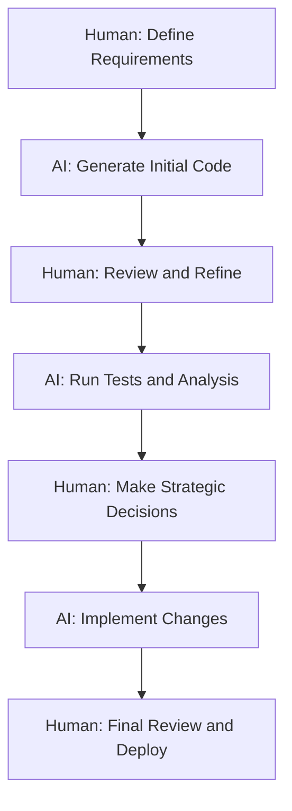

# Fostering Human-AI Collaboration in Development Teams

*Published on December 28, 2024 by Emily Johnson • 7 min read*

---

## Creating Synergistic Workflows Between Humans and AI

The future of software development isn't about AI replacing human developers—it's about creating powerful partnerships where human creativity and AI capabilities combine to achieve extraordinary results. This article explores strategies for fostering effective human-AI collaboration in modern development environments.

## Redefining the Developer-AI Relationship

### Beyond the "Replacement" Narrative

The conversation around AI in software development often centers on fear: Will AI replace developers? This question misses the point entirely. The most successful organizations are those that view AI as a powerful collaborator, not a replacement.

**Traditional View**: Human vs. AI
- Competition for tasks
- Fear of job displacement
- Resistance to adoption

**Collaborative View**: Human + AI
- Complementary strengths
- Enhanced capabilities
- Mutual augmentation

## Understanding Complementary Strengths

### What Humans Excel At

**Creative Problem Solving**
- Understanding complex business requirements
- Designing innovative solutions
- Making strategic architectural decisions
- Handling ambiguous or novel situations

**Contextual Understanding**
- Interpreting stakeholder needs
- Understanding business domain complexities
- Making ethical and judgment-based decisions
- Communicating with non-technical stakeholders

**Emotional Intelligence**
- Team collaboration and leadership
- Mentoring and knowledge transfer
- Conflict resolution
- User empathy and experience design

### What AI Excels At

**Pattern Recognition and Analysis**
- Analyzing large codebases for patterns
- Identifying potential bugs and vulnerabilities
- Optimizing performance bottlenecks
- Processing vast amounts of documentation

**Automation and Consistency**
- Generating boilerplate code
- Maintaining coding standards
- Running comprehensive tests
- Performing routine maintenance tasks

**Speed and Scale**
- Processing information rapidly
- Working across multiple projects simultaneously
- Maintaining 24/7 availability
- Handling repetitive tasks without fatigue

## Building Effective Collaboration Models

### The AI-Augmented Developer Workflow



### Collaboration Patterns

#### 1. **The AI Pair Programming Model**

**Human Role**: Driver and Navigator
- Sets the direction and goals
- Makes high-level decisions
- Reviews and validates AI suggestions

**AI Role**: Intelligent Assistant
- Suggests code implementations
- Identifies potential issues
- Provides real-time feedback

```python
# Example: AI-Human Pair Programming Session
def calculate_user_engagement(user_data):
    # Human: "I need to calculate user engagement metrics"
    # AI: Suggests comprehensive implementation
    
    engagement_score = 0
    
    # AI suggestion: Consider multiple engagement factors
    factors = {
        'login_frequency': user_data.get('logins_per_week', 0) * 0.3,
        'feature_usage': len(user_data.get('features_used', [])) * 0.25,
        'session_duration': user_data.get('avg_session_minutes', 0) * 0.2,
        'content_creation': user_data.get('content_created', 0) * 0.25
    }
    
    # Human: Reviews and approves the approach
    engagement_score = sum(factors.values())
    
    # AI: Suggests additional validation
    return min(engagement_score, 100)  # Cap at 100
```

#### 2. **The AI Code Review Assistant**

**Human Role**: Primary Reviewer
- Focuses on business logic and architecture
- Makes final approval decisions
- Provides context and domain knowledge

**AI Role**: Technical Analyst
- Identifies code quality issues
- Suggests performance improvements
- Flags security vulnerabilities

#### 3. **The AI Testing Partner**

**Human Role**: Test Strategy Designer
- Defines testing objectives
- Creates complex test scenarios
- Validates test results

**AI Role**: Test Generator and Executor
- Generates comprehensive test cases
- Executes automated test suites
- Identifies edge cases and gaps

## Implementing Collaborative Workflows

### Setting Up for Success

#### 1. **Establish Clear Roles and Boundaries**

Create explicit guidelines for when to rely on AI vs. human judgment:

```yaml
# Team AI Collaboration Guidelines
ai_responsibilities:
  - Code generation for well-defined requirements
  - Automated testing and quality checks
  - Performance optimization suggestions
  - Documentation generation

human_responsibilities:
  - Architecture and design decisions
  - Business requirement interpretation
  - Code review and final approval
  - Strategic planning and prioritization

shared_responsibilities:
  - Debugging complex issues
  - Refactoring legacy code
  - Performance optimization
  - Security analysis
```

#### 2. **Create Feedback Loops**

Establish mechanisms for continuous improvement:

**AI Learning from Human Feedback**
- Track acceptance rates of AI suggestions
- Collect feedback on AI-generated code quality
- Use human corrections to improve AI models

**Human Learning from AI Insights**
- Review AI-identified patterns and anti-patterns
- Learn from AI suggestions about best practices
- Understand AI reasoning for better collaboration

#### 3. **Build Trust Through Transparency**

**Make AI Decision-Making Visible**
```python
# Example: AI with explanation
def ai_suggest_optimization(code_block):
    suggestion = generate_optimization(code_block)
    explanation = {
        'reasoning': 'Detected O(n²) complexity in nested loops',
        'confidence': 0.85,
        'potential_impact': 'Reduces execution time by ~60%',
        'risks': 'May increase memory usage slightly'
    }
    return suggestion, explanation
```

## Overcoming Common Challenges

### Challenge 1: Over-Reliance on AI

**Symptoms**:
- Developers stop thinking critically about AI suggestions
- Blind acceptance of AI-generated code
- Loss of fundamental programming skills

**Solutions**:
- Implement mandatory human review processes
- Rotate AI usage among team members
- Regular "AI-free" development sessions
- Continuous education on AI limitations

### Challenge 2: Under-Utilization of AI

**Symptoms**:
- Developers avoid using AI tools
- Manual completion of tasks AI could handle
- Resistance to workflow changes

**Solutions**:
- Start with low-stakes, high-value use cases
- Provide comprehensive training and support
- Demonstrate clear productivity benefits
- Address concerns and misconceptions

### Challenge 3: Inconsistent AI Integration

**Symptoms**:
- Different team members use AI differently
- Lack of standardized workflows
- Inconsistent code quality and style

**Solutions**:
- Establish team-wide AI usage guidelines
- Standardize AI tools and configurations
- Regular team retrospectives on AI usage
- Shared learning and best practice sessions

## Measuring Collaboration Success

### Key Metrics

#### **Productivity Metrics**
- **Development velocity**: Story points completed per sprint
- **Time to market**: Feature delivery timelines
- **Code quality**: Bug rates and technical debt
- **Developer satisfaction**: Team happiness and retention

#### **Collaboration Quality**
- **AI suggestion acceptance rate**: Percentage of AI suggestions used
- **Human override frequency**: When humans modify AI suggestions
- **Learning velocity**: How quickly teams adapt to new AI capabilities
- **Knowledge transfer**: How well AI insights spread across the team

### Success Indicators

**Healthy Human-AI Collaboration**:
- ✅ Developers feel empowered, not threatened
- ✅ AI suggestions are critically evaluated, not blindly accepted
- ✅ Team productivity increases without sacrificing quality
- ✅ Developers learn new skills and approaches from AI
- ✅ AI systems improve through human feedback

## Best Practices for Team Leaders

### 1. **Foster a Learning Culture**

- Encourage experimentation with AI tools
- Share success stories and lessons learned
- Provide time for AI skill development
- Celebrate human-AI collaboration wins

### 2. **Maintain Human Agency**

- Ensure humans make final decisions on critical issues
- Preserve opportunities for creative problem-solving
- Maintain human oversight of AI systems
- Keep humans in the loop for ethical decisions

### 3. **Invest in Training**

**Technical Training**:
- How to effectively use AI development tools
- Understanding AI capabilities and limitations
- Prompt engineering and AI interaction skills

**Soft Skills Training**:
- Collaborating with AI systems
- Critical thinking about AI suggestions
- Balancing efficiency with quality

## The Future of Human-AI Collaboration

### Emerging Trends

**More Sophisticated AI Partners**
- Better understanding of context and intent
- Improved ability to explain reasoning
- Enhanced learning from human feedback

**Seamless Integration**
- AI embedded directly in development environments
- Natural language interfaces for AI interaction
- Real-time collaboration and feedback

**Specialized AI Assistants**
- Domain-specific AI models
- Role-based AI tools (architect AI, tester AI, etc.)
- Personalized AI that learns individual preferences

## Getting Started with Human-AI Collaboration

### Week 1-2: Foundation Setting
1. **Assess current team dynamics** and AI readiness
2. **Choose pilot AI tools** for specific use cases
3. **Establish collaboration guidelines** and boundaries
4. **Train team members** on selected tools

### Week 3-4: Initial Implementation
1. **Start with low-risk tasks** (code completion, documentation)
2. **Implement feedback mechanisms** for AI suggestions
3. **Monitor usage patterns** and team reactions
4. **Adjust workflows** based on initial feedback

### Month 2-3: Scaling and Optimization
1. **Expand AI usage** to more complex tasks
2. **Refine collaboration patterns** based on experience
3. **Share learnings** across the organization
4. **Measure and celebrate** productivity improvements

## Conclusion: The Synergistic Future

The most successful development teams of the future will be those that master the art of human-AI collaboration. By combining human creativity, judgment, and empathy with AI's speed, consistency, and analytical power, we can achieve levels of productivity and innovation that neither could reach alone.

The key is to approach this collaboration with intention, establishing clear roles, maintaining human agency, and continuously learning and adapting. When done right, human-AI collaboration doesn't just make us more productive—it makes us better developers.

---

*Emily Johnson is a Technical Team Lead and organizational psychologist with 12 years of experience in software development and team dynamics. She specializes in helping development teams successfully integrate AI tools while maintaining strong human collaboration and creativity.*