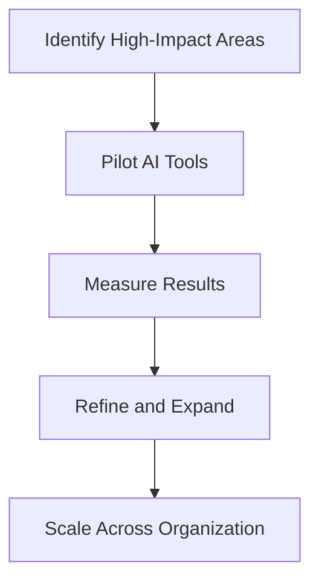

# Building AI-First Development Workflows

*Published on January 10, 2025 by Sarah Chen • 8 min read*

---

## Integrating AI Throughout the Development Lifecycle

The transition to AI-powered development isn't just about adopting new tools—it's about fundamentally rethinking how we structure our workflows. In this comprehensive guide, we'll explore how to integrate AI capabilities throughout your development lifecycle, from initial planning to deployment and ongoing maintenance.

## Understanding AI-First Workflows

An AI-first workflow is one where artificial intelligence is not an add-on or afterthought, but a core component that influences every stage of development. This approach requires us to:

- **Design processes** that leverage AI capabilities
- **Structure data** to feed intelligent systems
- **Create feedback loops** that improve AI performance over time
- **Balance automation** with human oversight and creativity

## The AI-Enhanced Development Lifecycle

### 1. Planning & Requirements Gathering

Traditional planning relies heavily on human analysis and estimation. AI-first workflows enhance this phase by:

#### **Intelligent Requirement Analysis**
```markdown
AI System: Analyzes user stories and requirements
- Identifies potential conflicts or gaps
- Suggests missing requirements based on similar projects
- Estimates complexity and effort using historical data
```

#### **Automated Project Scoping**
- AI analyzes project descriptions and generates detailed scope documents
- Identifies potential risks and dependencies
- Suggests optimal team composition and timeline

#### **Smart Sprint Planning**
- AI recommends story prioritization based on business value and technical dependencies
- Predicts sprint capacity based on team velocity and complexity analysis
- Automatically generates acceptance criteria suggestions

### 2. Design & Architecture

AI transforms the design phase by providing intelligent insights and automation:

#### **Architecture Recommendations**
- AI analyzes requirements and suggests optimal architectural patterns
- Identifies potential scalability and performance bottlenecks
- Recommends technology stack based on project needs and team expertise

#### **Automated Design Documentation**
- AI generates architecture diagrams from code and requirements
- Creates and maintains design documentation automatically
- Suggests design improvements based on best practices

### 3. Development & Coding

This is where AI-first workflows show their most dramatic impact:

#### **Intelligent Code Generation**
```python
# AI-assisted development example
def generate_user_service(requirements):
    """
    AI analyzes requirements and generates:
    - Database models
    - API endpoints
    - Business logic
    - Unit tests
    - Documentation
    """
    return ai_code_generator.create_service(requirements)
```

#### **Real-time Code Review**
- AI provides instant feedback on code quality, security, and performance
- Suggests improvements and alternative implementations
- Identifies potential bugs before they reach human reviewers

#### **Automated Refactoring**
- AI identifies code smells and suggests refactoring opportunities
- Automatically applies safe refactoring patterns
- Maintains code quality metrics and trends

### 4. Testing & Quality Assurance

AI revolutionizes testing by making it more comprehensive and efficient:

#### **Intelligent Test Generation**
- AI analyzes code and automatically generates comprehensive test suites
- Creates edge case scenarios based on code analysis
- Generates performance and security tests

#### **Automated Test Maintenance**
- AI updates tests when code changes
- Identifies and fixes flaky tests
- Optimizes test execution order and parallelization

#### **Smart Bug Detection**
- AI analyzes code patterns to predict potential bugs
- Identifies security vulnerabilities using pattern recognition
- Suggests fixes for common issues

### 5. Deployment & DevOps

AI-first workflows extend into deployment and operations:

#### **Intelligent Deployment Strategies**
- AI analyzes system load and suggests optimal deployment timing
- Automatically rolls back deployments if anomalies are detected
- Optimizes resource allocation based on predicted usage patterns

#### **Automated Infrastructure Management**
- AI manages scaling decisions based on real-time metrics
- Predicts and prevents system failures
- Optimizes cloud resource usage and costs

### 6. Monitoring & Maintenance

Post-deployment, AI continues to add value:

#### **Predictive Maintenance**
- AI analyzes system metrics to predict potential failures
- Suggests proactive maintenance actions
- Identifies performance optimization opportunities

#### **Automated Issue Resolution**
- AI triages and categorizes incoming issues
- Suggests solutions based on historical data
- Automatically fixes common problems

## Implementation Best Practices

### Start Small, Scale Gradually



### Maintain Human Oversight

While AI can automate many tasks, human oversight remains crucial:

- **Code Review**: AI suggestions should be reviewed by experienced developers
- **Architecture Decisions**: Major architectural choices require human judgment
- **Business Logic**: Complex business rules need human validation

### Create Feedback Loops

AI systems improve with feedback:
- Track AI suggestion acceptance rates
- Collect developer feedback on AI recommendations
- Continuously retrain models with new data

## Tools and Technologies

### Popular AI Development Tools

| Category | Tools | Use Case |
|----------|-------|----------|
| Code Generation | GitHub Copilot, Tabnine, CodeT5 | Automated code completion and generation |
| Code Review | DeepCode, SonarQube AI | Intelligent code analysis and review |
| Testing | Testim, Applitools | AI-powered test generation and maintenance |
| DevOps | DataDog AI, New Relic AI | Intelligent monitoring and operations |

## Measuring Success

Track these key metrics to measure the success of your AI-first workflows:

### Development Velocity
- **Time to market** for new features
- **Sprint velocity** and predictability
- **Code review** turnaround time

### Quality Metrics
- **Bug detection** rate and resolution time
- **Code quality** scores and trends
- **Test coverage** and effectiveness

### Team Satisfaction
- **Developer productivity** and satisfaction surveys
- **Learning curve** and adoption rates
- **Work-life balance** improvements

## Common Challenges and Solutions

### Challenge 1: Resistance to Change
**Solution**: Start with enthusiastic early adopters and demonstrate clear value before expanding.

### Challenge 2: Over-reliance on AI
**Solution**: Maintain clear guidelines on when human judgment is required.

### Challenge 3: Data Quality Issues
**Solution**: Invest in data quality and establish clear data governance practices.

## The Future of AI-First Workflows

As AI technology continues to evolve, we can expect:

- **More sophisticated** code generation capabilities
- **Better integration** between different AI tools
- **Improved understanding** of business context and requirements
- **Enhanced collaboration** between human developers and AI systems

## Getting Started Today

Ready to implement AI-first workflows in your organization? Here's your action plan:

1. **Assess Current State**: Evaluate your existing development processes
2. **Identify Opportunities**: Find areas where AI can provide immediate value
3. **Start Small**: Pilot AI tools in low-risk areas
4. **Measure and Learn**: Track results and gather feedback
5. **Scale Gradually**: Expand successful implementations across your organization

The future of software development is AI-first. By starting your transformation today, you'll be well-positioned to leverage the full potential of intelligent development workflows.

---

*Sarah Chen is a Senior Software Architect with over 10 years of experience in enterprise software development. She specializes in AI integration and has helped numerous organizations transition to AI-first development methodologies.*