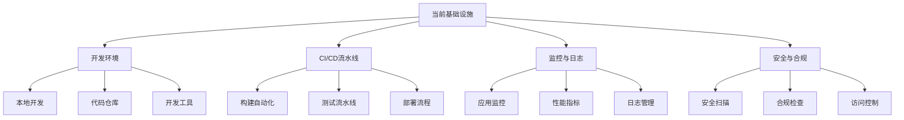
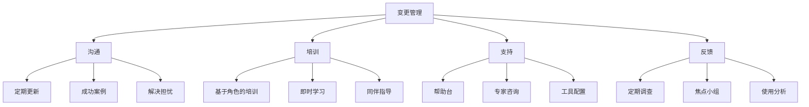

# ASDM三步实施指南

*发布于2024年12月20日 作者：David Kim • 阅读时间10分钟*

---

## ASDM方法论的全面实施指南

在您的组织中实施AI驱动的系统开发方法论(ASDM)需要一个结构化的分阶段方法。本综合指南将带您了解三个关键阶段：评估与规划、基础设施建设、实施与扩展。每个阶段都建立在前一个阶段的基础上，确保向AI优先开发实践的平稳过渡。

## 为什么采用分阶段方法？

转变开发方法论是复杂且有风险的。分阶段方法提供了几个优势：

- **降低风险**：渐进式实施允许过程修正
- **学习机会**：每个阶段为下一阶段提供见解
- **变更管理**：团队可以逐步适应新流程
- **可衡量的进展**：明确的里程碑和成功指标
- **资源优化**：将成本和工作量分散到时间线上

## 第一阶段：评估与规划（第1-4周）

成功实施ASDM的基础在于彻底的评估和战略规划。

### 1.1 现状分析

#### **开发流程审计**

首先记录您当前的开发流程：

```yaml
# 现状评估模板
development_lifecycle:
  planning:
    tools: [Jira, Confluence, Miro]
    duration: "每个史诗2-3周"
    pain_points: ["需求模糊", "估算准确性"]
  
  development:
    languages: [Java, Python, JavaScript]
    frameworks: [Spring Boot, React, Node.js]
    tools: [IntelliJ, VS Code, Git]
    pain_points: ["代码审查瓶颈", "技术债务"]
  
  testing:
    types: [单元测试, 集成测试, 端到端测试]
    automation_level: "60%"
    tools: [JUnit, Selenium, Jest]
    pain_points: ["不稳定的测试", "反馈循环缓慢"]
  
  deployment:
    strategy: "蓝绿部署"
    frequency: "每周发布"
    tools: [Jenkins, Docker, Kubernetes]
    pain_points: ["手动部署步骤", "回滚复杂性"]
```

#### **团队技能评估**

评估您团队对AI集成的准备程度：

**技术技能清单**：
- 编程语言熟练程度
- AI/ML概念熟悉度
- 自动化工具经验
- 云平台知识

**软技能评估**：
- 对新技术的适应性
- 协作和沟通能力
- 问题解决方法
- 学习敏捷性

#### **基础设施评估**

评估您当前的技术基础设施：



### 1.2 AI集成机会

#### **高影响领域识别**

识别AI可以提供即时价值的领域：

**代码生成与补全**
- 样板代码减少：节省70%时间
- API端点生成：开发速度提升50%
- 测试用例创建：覆盖率提升80%

**质量保证**
- 自动化代码审查：审查速度提升60%
- 缺陷预测：生产问题减少40%
- 安全漏洞检测：90%覆盖率

**DevOps与监控**
- 自动化部署决策：发布速度提升30%
- 预测性扩展：成本降低25%
- 事件响应：解决速度提升50%

#### **ROI分析**

计算潜在投资回报：

```python
# ROI计算示例
def calculate_ai_roi(current_metrics, projected_improvements):
    """
    计算AI实施的ROI
    """
    current_cost = {
        'development_time': current_metrics['dev_hours'] * current_metrics['hourly_rate'],
        'bug_fixing': current_metrics['bug_hours'] * current_metrics['hourly_rate'],
        'deployment_time': current_metrics['deploy_hours'] * current_metrics['hourly_rate']
    }
    
    improved_cost = {
        'development_time': current_cost['development_time'] * (1 - projected_improvements['dev_efficiency']),
        'bug_fixing': current_cost['bug_fixing'] * (1 - projected_improvements['bug_reduction']),
        'deployment_time': current_cost['deployment_time'] * (1 - projected_improvements['deploy_efficiency'])
    }
    
    annual_savings = sum(current_cost.values()) - sum(improved_cost.values())
    implementation_cost = projected_improvements['ai_tools_cost'] + projected_improvements['training_cost']
    
    roi = (annual_savings - implementation_cost) / implementation_cost * 100
    payback_period = implementation_cost / (annual_savings / 12)  # 月数
    
    return {
        'annual_savings': annual_savings,
        'roi_percentage': roi,
        'payback_months': payback_period
    }
```

### 1.3 战略规划

#### **实施路线图**

创建具有明确里程碑的详细路线图：

**第一季度：基础建设**
- 第1-4周：评估与规划
- 第5-8周：工具选择和采购
- 第9-12周：基础设施搭建

**第二季度：试点实施**
- 第13-16周：团队培训和入职
- 第17-20周：试点项目执行
- 第21-24周：结果分析和优化

**第三-四季度：扩展**
- 第25-36周：逐步推广到所有团队
- 第37-48周：优化和高级功能

#### **成功指标定义**

建立明确、可衡量的成功标准：

**生产力指标**：
- 开发速度（故事点/冲刺）
- 上市时间（功能交付时间）
- 代码审查周转时间
- 部署频率

**质量指标**：
- 缺陷密度（每千行代码的缺陷数）
- 生产事件频率
- 安全漏洞数量
- 技术债务比率

**团队满意度**：
- 开发者满意度评分
- 工具采用率
- 学习曲线指标
- 留存率

## 第二阶段：基础设施建设（第5-16周）

此阶段专注于为AI驱动开发建立技术和组织基础。

### 2.1 基础设施准备

#### **AI就绪架构**

设计能够有效利用AI的系统：

```yaml
# AI就绪架构组件
data_layer:
  - structured_logging: "启用AI日志分析"
  - metrics_collection: "全面的性能数据"
  - code_metadata: "AI工具的语义信息"

api_layer:
  - standardized_apis: "AI集成的一致接口"
  - webhook_support: "实时AI通知"
  - rate_limiting: "防止AI工具过度使用"

security_layer:
  - api_key_management: "安全的AI工具认证"
  - data_privacy: "保护敏感信息"
  - audit_logging: "跟踪AI工具使用"
```

#### **工具集成平台**

建立AI工具管理的集中平台：

**开发环境集成**：
- IDE插件和扩展
- 命令行工具集成
- 自动分析的Git钩子

**CI/CD流水线增强**：
- AI驱动的代码分析阶段
- 自动化测试生成
- 智能部署决策

### 2.2 团队培训和入职

#### **综合培训计划**

**第1-2周：AI基础**
- 理解AI能力和局限性
- AI伦理和负责任使用
- AI开发工具概述

**第3-4周：实践工具培训**
- 代码补全和生成工具
- 自动化测试框架
- AI驱动的代码审查系统

**第5-6周：工作流集成**
- 将AI融入日常工作流
- 人机协作最佳实践
- 常见问题故障排除

#### **培训材料和资源**

```markdown
# 培训资源库

## 文档
- AI工具用户指南
- 最佳实践手册
- 故障排除指南
- 常见问题解答

## 互动学习
- 实践研讨会
- 结对编程会话
- 代码审查练习
- 真实项目实施

## 持续支持
- 每周答疑时间
- Slack/Teams支持频道
- 同伴指导计划
- 定期反馈会议
```

### 2.3 试点项目选择

#### **理想试点项目特征**

选择能最大化学习同时最小化风险的项目：

**技术标准**：
- 明确定义的需求
- 中等复杂度
- 有限的外部依赖
- 明确的成功指标

**组织标准**：
- 热情的团队成员
- 支持性利益相关者
- 灵活的时间表
- 低业务风险

#### **试点项目框架**

```python
# 试点项目评估框架
class PilotProject:
    def __init__(self, name, team, requirements):
        self.name = name
        self.team = team
        self.requirements = requirements
        self.ai_tools = []
        self.metrics = {}
    
    def evaluate_suitability(self):
        """评估项目对AI试点的适用性"""
        score = 0
        
        # 技术复杂度（中等为理想）
        if 3 <= self.requirements.complexity <= 7:
            score += 20
        
        # 团队热情
        if self.team.ai_enthusiasm > 7:
            score += 25
        
        # 需求清晰度
        if self.requirements.clarity > 8:
            score += 20
        
        # 业务影响（中等风险）
        if 4 <= self.requirements.business_impact <= 7:
            score += 15
        
        # 时间表灵活性
        if self.requirements.timeline_flexibility > 6:
            score += 20
        
        return score
```

## 第三阶段：实施与扩展（第17-48周）

最后阶段专注于在整个组织中部署AI工具并扩展成功实践。

### 3.1 渐进式推广策略

#### **推广阶段**

**阶段3A：核心团队实施（第17-24周）**
- 向试点团队部署AI工具
- 监控使用情况并收集反馈
- 基于学习优化流程

**阶段3B：部门扩展（第25-36周）**
- 扩展到其他开发团队
- 标准化成功实践
- 解决扩展挑战

**阶段3C：组织级部署（第37-48周）**
- 全组织推广
- 高级AI功能实施
- 持续优化

#### **变更管理策略**



### 3.2 扩展最佳实践

#### **标准化框架**

为AI工具使用创建组织级标准：

**代码生成标准**：
```yaml
ai_code_generation:
  approval_required:
    - 架构变更
    - 安全敏感代码
    - 性能关键部分
  
  automatic_approval:
    - 样板代码
    - 测试用例生成
    - 文档更新
  
  review_process:
    - AI生成的代码必须审查
    - 在审查中包含AI置信度分数
    - 在提交消息中记录AI工具使用
```

**质量门禁**：
- 最低代码审查要求
- 自动化测试阈值
- 安全扫描合规性
- 性能基准

#### **知识共享平台**

建立学习分享机制：

**内部Wiki**：
- 最佳实践文档
- 工具配置指南
- 故障排除资源
- 成功案例研究

**定期论坛**：
- 月度AI工具用户会议
- 季度最佳实践回顾
- 年度AI开发大会
- 跨团队协作会议

### 3.3 持续优化

#### **性能监控**

持续跟踪关键指标：

```python
# 指标仪表板示例
class ASDMMetricsDashboard:
    def __init__(self):
        self.metrics = {
            'productivity': {},
            'quality': {},
            'satisfaction': {},
            'adoption': {}
        }
    
    def collect_productivity_metrics(self):
        """收集开发生产力指标"""
        return {
            'velocity_trend': self.calculate_velocity_trend(),
            'cycle_time': self.calculate_cycle_time(),
            'deployment_frequency': self.calculate_deployment_frequency(),
            'lead_time': self.calculate_lead_time()
        }
    
    def collect_quality_metrics(self):
        """收集代码质量指标"""
        return {
            'bug_density': self.calculate_bug_density(),
            'security_vulnerabilities': self.count_security_issues(),
            'technical_debt': self.measure_technical_debt(),
            'test_coverage': self.calculate_test_coverage()
        }
    
    def generate_insights(self):
        """从指标生成可操作的见解"""
        insights = []
        
        if self.metrics['productivity']['velocity_trend'] > 1.2:
            insights.append("生产力显著提升 - 考虑扩大AI工具使用")
        
        if self.metrics['quality']['bug_density'] < 0.5:
            insights.append("质量改进检测到 - AI工具有效减少缺陷")
        
        return insights
```

#### **反馈循环实施**

创建系统性反馈机制：

**开发者反馈**：
- 每周脉搏调查
- 月度回顾
- 季度满意度评估
- 年度综合审查

**工具性能反馈**：
- AI建议接受率
- 工具使用分析
- 性能影响测量
- 成本效益分析更新

## 常见实施挑战和解决方案

### 挑战1：变革阻力

**症状**：
- 工具采用率低
- 对AI工具的负面反馈
- 偏好传统方法

**解决方案**：
- 从热情的早期采用者开始
- 通过试点项目展示明确价值
- 提供全面的培训和支持
- 透明地解决担忧

### 挑战2：过度依赖AI

**症状**：
- 批判性思维下降
- 盲目接受AI建议
- 基础技能学习减少

**解决方案**：
- 实施强制性人工审查流程
- 提供AI局限性教育
- 在团队成员间轮换AI使用
- 维持"无AI"开发会话

### 挑战3：集成复杂性

**症状**：
- 工具协作不佳
- 工作流中断
- 技术配置问题

**解决方案**：
- 投资适当的工具集成
- 标准化开发环境
- 提供专门的技术支持
- 选择具有良好互操作性的工具

## 衡量成功

### 关键绩效指标

**定量指标**：
- 开发速度提升40%
- 缺陷密度降低60%
- 上市时间缩短50%
- 部署频率增加30%

**定性指标**：
- 开发者满意度评分提升
- 代码质量评级提高
- 团队协作改善
- 学习和技能发展增强

### 成功庆祝和沟通

**内部沟通**：
- 向领导层定期进展更新
- 跨团队成功案例分享
- 早期采用者和倡导者认可
- 经验教训文档化

**外部沟通**：
- 会议演讲
- 博客文章和案例研究
- 行业最佳实践分享
- 思想领导力内容

## 结论：您的ASDM之旅

实施ASDM是一个变革性的旅程，需要仔细规划、专注执行和持续优化。通过遵循这个三阶段方法，您将能够成功地将AI集成到开发流程中，同时保持质量、生产力和团队满意度。

请记住，ASDM实施不是一个终点，而是一个持续的演进。随着AI技术的不断进步，您的实施应该适应和成长，始终专注于增强人类能力而不是替代它们。

今天成功实施ASDM的组织将成为明天软件开发的领导者。现在开始您的旅程，加入AI驱动开发方法论的革命。

---

*David Kim是一位高级工程经理和ASDM实施专家，在软件开发和组织转型方面拥有超过15年的经验。他已成功在多家财富500强公司和初创企业领导ASDM实施，帮助团队实现前所未有的生产力和创新水平。*