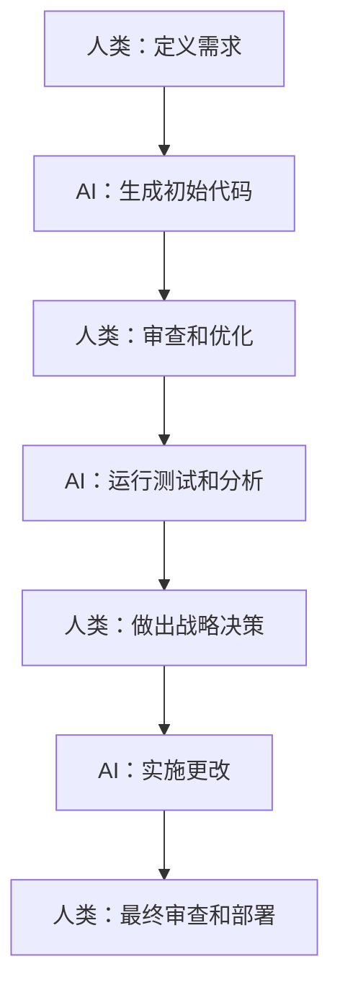

# 在开发团队中促进人机协作

*发布于2024年12月28日 作者：Emily Johnson • 阅读时间7分钟*

---

## 在人类和AI之间创建协同工作流

软件开发的未来不是AI取代人类开发者——而是创建强大的合作伙伴关系，让人类创造力和AI能力结合起来实现非凡的结果。本文探讨了在现代开发环境中促进有效人机协作的策略。

## 重新定义开发者-AI关系

### 超越"替代"叙述

围绕软件开发中AI的对话往往集中在恐惧上：AI会取代开发者吗？这个问题完全没有抓住要点。最成功的组织是那些将AI视为强大协作者而非替代品的组织。

**传统观点**：人类 vs. AI
- 任务竞争
- 对工作被取代的恐惧
- 对采用的抗拒

**协作观点**：人类 + AI
- 互补优势
- 增强能力
- 相互促进

## 理解互补优势

### 人类擅长的领域

**创造性问题解决**
- 理解复杂的业务需求
- 设计创新解决方案
- 做出战略架构决策
- 处理模糊或新颖的情况

**上下文理解**
- 解释利益相关者需求
- 理解业务领域复杂性
- 做出伦理和基于判断的决策
- 与非技术利益相关者沟通

**情商**
- 团队协作和领导力
- 指导和知识传递
- 冲突解决
- 用户同理心和体验设计

### AI擅长的领域

**模式识别和分析**
- 分析大型代码库中的模式
- 识别潜在缺陷和漏洞
- 优化性能瓶颈
- 处理大量文档

**自动化和一致性**
- 生成样板代码
- 维护编码标准
- 运行全面测试
- 执行常规维护任务

**速度和规模**
- 快速处理信息
- 同时处理多个项目
- 保持24/7可用性
- 处理重复任务而不疲劳

## 构建有效的协作模型

### AI增强的开发者工作流



### 协作模式

#### 1. **AI结对编程模型**

**人类角色**：驾驶员和导航员
- 设定方向和目标
- 做出高级决策
- 审查和验证AI建议

**AI角色**：智能助手
- 建议代码实现
- 识别潜在问题
- 提供实时反馈

```python
# 示例：AI-人类结对编程会话
def calculate_user_engagement(user_data):
    # 人类："我需要计算用户参与度指标"
    # AI：建议全面实现
    
    engagement_score = 0
    
    # AI建议：考虑多个参与度因素
    factors = {
        'login_frequency': user_data.get('logins_per_week', 0) * 0.3,
        'feature_usage': len(user_data.get('features_used', [])) * 0.25,
        'session_duration': user_data.get('avg_session_minutes', 0) * 0.2,
        'content_creation': user_data.get('content_created', 0) * 0.25
    }
    
    # 人类：审查并批准方法
    engagement_score = sum(factors.values())
    
    # AI：建议额外验证
    return min(engagement_score, 100)  # 上限为100
```

#### 2. **AI代码审查助手**

**人类角色**：主要审查员
- 专注于业务逻辑和架构
- 做出最终批准决策
- 提供上下文和领域知识

**AI角色**：技术分析师
- 识别代码质量问题
- 建议性能改进
- 标记安全漏洞

#### 3. **AI测试伙伴**

**人类角色**：测试策略设计师
- 定义测试目标
- 创建复杂测试场景
- 验证测试结果

**AI角色**：测试生成器和执行器
- 生成全面的测试用例
- 执行自动化测试套件
- 识别边界情况和缺口

## 实施协作工作流

### 为成功做准备

#### 1. **建立明确的角色和边界**

为何时依赖AI vs.人类判断创建明确指导原则：

```yaml
# 团队AI协作指导原则
ai_responsibilities:
  - 为明确定义的需求生成代码
  - 自动化测试和质量检查
  - 性能优化建议
  - 文档生成

human_responsibilities:
  - 架构和设计决策
  - 业务需求解释
  - 代码审查和最终批准
  - 战略规划和优先级排序

shared_responsibilities:
  - 调试复杂问题
  - 重构遗留代码
  - 性能优化
  - 安全分析
```

#### 2. **创建反馈循环**

建立持续改进机制：

**AI从人类反馈中学习**
- 跟踪AI建议的接受率
- 收集对AI生成代码质量的反馈
- 使用人类修正来改进AI模型

**人类从AI洞察中学习**
- 审查AI识别的模式和反模式
- 从AI关于最佳实践的建议中学习
- 理解AI推理以实现更好的协作

#### 3. **通过透明度建立信任**

**使AI决策制定可见**
```python
# 示例：带解释的AI
def ai_suggest_optimization(code_block):
    suggestion = generate_optimization(code_block)
    explanation = {
        'reasoning': '在嵌套循环中检测到O(n²)复杂度',
        'confidence': 0.85,
        'potential_impact': '减少约60%的执行时间',
        'risks': '可能会略微增加内存使用'
    }
    return suggestion, explanation
```

## 克服常见挑战

### 挑战1：过度依赖AI

**症状**：
- 开发者停止对AI建议进行批判性思考
- 盲目接受AI生成的代码
- 失去基本编程技能

**解决方案**：
- 实施强制性人工审查流程
- 在团队成员间轮换AI使用
- 定期"无AI"开发会话
- 持续教育AI局限性

### 挑战2：AI利用不足

**症状**：
- 开发者避免使用AI工具
- 手动完成AI可以处理的任务
- 对工作流变更的抗拒

**解决方案**：
- 从低风险、高价值用例开始
- 提供全面的培训和支持
- 展示明确的生产力收益
- 解决担忧和误解

### 挑战3：AI集成不一致

**症状**：
- 不同团队成员使用AI的方式不同
- 缺乏标准化工作流
- 代码质量和风格不一致

**解决方案**：
- 建立团队范围的AI使用指导原则
- 标准化AI工具和配置
- 定期团队AI使用回顾
- 共享学习和最佳实践会议

## 衡量协作成功

### 关键指标

#### **生产力指标**
- **开发速度**：每冲刺完成的故事点
- **上市时间**：功能交付时间线
- **代码质量**：缺陷率和技术债务
- **开发者满意度**：团队幸福感和留存率

#### **协作质量**
- **AI建议接受率**：使用的AI建议百分比
- **人工覆盖频率**：人类修改AI建议的时候
- **学习速度**：团队适应新AI能力的速度
- **知识传递**：AI洞察在团队中传播的程度

### 成功指标

**健康的人机协作**：
- ✅ 开发者感到被赋能，而非受威胁
- ✅ AI建议被批判性评估，而非盲目接受
- ✅ 团队生产力提高而不牺牲质量
- ✅ 开发者从AI中学习新技能和方法
- ✅ AI系统通过人类反馈改进

## 团队领导者的最佳实践

### 1. **培养学习文化**

- 鼓励AI工具实验
- 分享成功故事和经验教训
- 为AI技能发展提供时间
- 庆祝人机协作胜利

### 2. **保持人类主导权**

- 确保人类在关键问题上做最终决策
- 保留创造性问题解决的机会
- 维护对AI系统的人工监督
- 在伦理决策中保持人类参与

### 3. **投资培训**

**技术培训**：
- 如何有效使用AI开发工具
- 理解AI能力和局限性
- 提示工程和AI交互技能

**软技能培训**：
- 与AI系统协作
- 对AI建议的批判性思考
- 平衡效率与质量

## 人机协作的未来

### 新兴趋势

**更复杂的AI伙伴**
- 更好地理解上下文和意图
- 改进解释推理的能力
- 增强从人类反馈中学习

**无缝集成**
- AI直接嵌入开发环境
- AI交互的自然语言界面
- 实时协作和反馈

**专业化AI助手**
- 领域特定的AI模型
- 基于角色的AI工具（架构师AI、测试员AI等）
- 学习个人偏好的个性化AI

## 开始人机协作

### 第1-2周：基础设置
1. **评估当前团队动态**和AI准备度
2. **选择试点AI工具**用于特定用例
3. **建立协作指导原则**和边界
4. **培训团队成员**使用选定工具

### 第3-4周：初始实施
1. **从低风险任务开始**（代码补全、文档）
2. **实施反馈机制**用于AI建议
3. **监控使用模式**和团队反应
4. **基于初始反馈调整工作流**

### 第2-3个月：扩展和优化
1. **扩展AI使用**到更复杂的任务
2. **基于经验优化协作模式**
3. **在组织内分享学习**
4. **衡量和庆祝**生产力改进

## 结论：协同的未来

未来最成功的开发团队将是那些掌握人机协作艺术的团队。通过将人类的创造力、判断力和同理心与AI的速度、一致性和分析能力相结合，我们可以达到任何一方单独都无法达到的生产力和创新水平。

关键是要有意识地处理这种协作，建立明确的角色，保持人类主导权，并持续学习和适应。做得对的话，人机协作不仅让我们更有生产力——它让我们成为更好的开发者。

---

*Emily Johnson是一位技术团队负责人和组织心理学家，在软件开发和团队动态方面拥有12年经验。她专门帮助开发团队成功集成AI工具，同时保持强大的人类协作和创造力。*