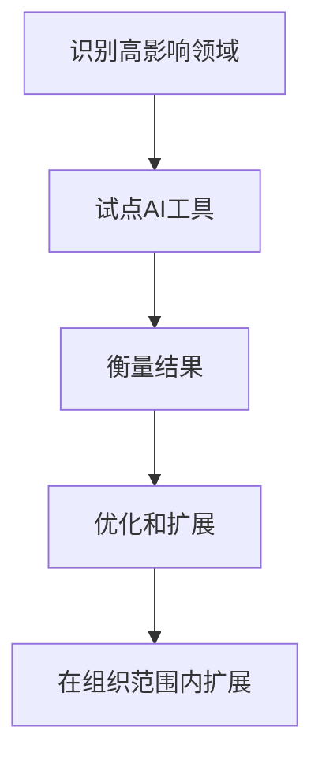

# 构建AI优先的开发工作流

*发布于2025年1月10日 作者：Sarah Chen • 阅读时间8分钟*

---

## 在整个开发生命周期中集成AI

向AI驱动开发的转型不仅仅是采用新工具——它是从根本上重新思考我们如何构建工作流程。在这个综合指南中，我们将探索如何在整个开发生命周期中集成AI能力，从初始规划到部署和持续维护。

## 理解AI优先工作流

AI优先工作流是指人工智能不是附加功能或事后考虑，而是影响开发每个阶段的核心组件。这种方法要求我们：

- **设计流程**以利用AI能力
- **构建数据**来供给智能系统
- **创建反馈循环**以随时间改进AI性能
- **平衡自动化**与人工监督和创造力

## AI增强的开发生命周期

### 1. 规划与需求收集

传统规划严重依赖人工分析和估算。AI优先工作流通过以下方式增强这一阶段：

#### **智能需求分析**
```markdown
AI系统：分析用户故事和需求
- 识别潜在冲突或缺口
- 基于类似项目建议缺失需求
- 使用历史数据估算复杂性和工作量
```

#### **自动化项目范围界定**
- AI分析项目描述并生成详细的范围文档
- 识别潜在风险和依赖关系
- 建议最优团队组成和时间线

#### **智能冲刺规划**
- AI基于业务价值和技术依赖关系推荐故事优先级
- 基于团队速度和复杂性分析预测冲刺容量
- 自动生成验收标准建议

### 2. 设计与架构

AI通过提供智能洞察和自动化来转变设计阶段：

#### **架构推荐**
- AI分析需求并建议最优架构模式
- 识别潜在的可扩展性和性能瓶颈
- 基于项目需求和团队专业知识推荐技术栈

#### **自动化设计文档**
- AI从代码和需求生成架构图
- 自动创建和维护设计文档
- 基于最佳实践建议设计改进

### 3. 开发与编码

这是AI优先工作流显示最显著影响的地方：

#### **智能代码生成**
```python
# AI辅助开发示例
def generate_user_service(requirements):
    """
    AI分析需求并生成：
    - 数据库模型
    - API端点
    - 业务逻辑
    - 单元测试
    - 文档
    """
    return ai_code_generator.create_service(requirements)
```

#### **实时代码审查**
- AI提供关于代码质量、安全性和性能的即时反馈
- 建议改进和替代实现
- 在到达人工审查员之前识别潜在缺陷

#### **自动化重构**
- AI识别代码异味并建议重构机会
- 自动应用安全的重构模式
- 维护代码质量指标和趋势

### 4. 测试与质量保证

AI通过使测试更全面和高效来革命化测试：

#### **智能测试生成**
- AI分析代码并自动生成全面的测试套件
- 基于代码分析创建边界情况场景
- 生成性能和安全测试

#### **自动化测试维护**
- AI在代码更改时更新测试
- 识别并修复不稳定的测试
- 优化测试执行顺序和并行化

#### **智能缺陷检测**
- AI分析代码模式以预测潜在缺陷
- 使用模式识别识别安全漏洞
- 为常见问题建议修复方案

### 5. 部署与DevOps

AI优先工作流扩展到部署和运维：

#### **智能部署策略**
- AI分析系统负载并建议最优部署时机
- 如果检测到异常自动回滚部署
- 基于预测使用模式优化资源分配

#### **自动化基础设施管理**
- AI基于实时指标管理扩展决策
- 预测并防止系统故障
- 优化云资源使用和成本

### 6. 监控与维护

部署后，AI继续增加价值：

#### **预测性维护**
- AI分析系统指标以预测潜在故障
- 建议主动维护行动
- 识别性能优化机会

#### **自动化问题解决**
- AI对传入问题进行分类和归类
- 基于历史数据建议解决方案
- 自动修复常见问题

## 实施最佳实践

### 从小开始，逐步扩展



### 保持人工监督

虽然AI可以自动化许多任务，但人工监督仍然至关重要：

- **代码审查**：AI建议应由经验丰富的开发者审查
- **架构决策**：主要架构选择需要人工判断
- **业务逻辑**：复杂的业务规则需要人工验证

### 创建反馈循环

AI系统通过反馈改进：
- 跟踪AI建议接受率
- 收集开发者对AI推荐的反馈
- 使用新数据持续重新训练模型

## 工具和技术

### 流行的AI开发工具

| 类别 | 工具 | 用例 |
|----------|-------|----------|
| 代码生成 | GitHub Copilot, Tabnine, CodeT5 | 自动化代码补全和生成 |
| 代码审查 | DeepCode, SonarQube AI | 智能代码分析和审查 |
| 测试 | Testim, Applitools | AI驱动的测试生成和维护 |
| DevOps | DataDog AI, New Relic AI | 智能监控和运维 |

## 衡量成功

跟踪这些关键指标来衡量AI优先工作流的成功：

### 开发速度
- 新功能的**上市时间**
- **冲刺速度**和可预测性
- **代码审查**周转时间

### 质量指标
- **缺陷检测**率和解决时间
- **代码质量**评分和趋势
- **测试覆盖率**和有效性

### 团队满意度
- **开发者生产力**和满意度调查
- **学习曲线**和采用率
- **工作生活平衡**改善

## 常见挑战和解决方案

### 挑战1：变革阻力
**解决方案**：从热情的早期采用者开始，在扩展前展示明确价值。

### 挑战2：过度依赖AI
**解决方案**：维护关于何时需要人工判断的明确指导原则。

### 挑战3：数据质量问题
**解决方案**：投资数据质量并建立明确的数据治理实践。

## AI优先工作流的未来

随着AI技术的持续发展，我们可以期待：

- **更复杂的**代码生成能力
- 不同AI工具之间**更好的集成**
- 对业务上下文和需求的**改进理解**
- 人类开发者和AI系统之间**增强的协作**

## 今天就开始

准备在您的组织中实施AI优先工作流？这是您的行动计划：

1. **评估现状**：评估您现有的开发流程
2. **识别机会**：找到AI可以提供即时价值的领域
3. **从小开始**：在低风险领域试点AI工具
4. **衡量和学习**：跟踪结果并收集反馈
5. **逐步扩展**：在整个组织中扩展成功的实施

软件开发的未来是AI优先的。通过今天开始您的转型，您将能够充分利用智能开发工作流的潜力。

---

*Sarah Chen是一位拥有超过10年企业软件开发经验的高级软件架构师。她专门从事AI集成，并帮助众多组织转向AI优先的开发方法论。*