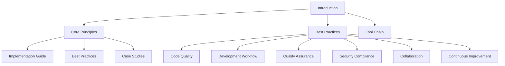

# Introduction to ASDM

AI-Supported Development Methodology (ASDM) is a comprehensive approach to software development that leverages artificial intelligence to enhance and streamline the development process. This methodology combines traditional software development practices with AI-powered tools and techniques to improve efficiency, quality, and innovation in software projects.

## Documentation Structure

This documentation is organized into three main sections:
- **Core Principles**: Fundamental concepts and philosophies of ASDM
- **Best Practices**: Practical implementation guidelines and recommendations
- **Tool Chain**: Tools and technologies that support ASDM implementation

## Key Objectives

1. **Enhanced Development Efficiency**
   - Accelerate development cycles through AI assistance
   - Reduce repetitive tasks and boilerplate code
   - Streamline code review and testing processes

2. **Improved Code Quality**
   - Leverage AI for code analysis and optimization
   - Ensure consistent coding standards
   - Identify potential issues early in development

3. **Better Decision Making**
   - Use AI insights for architectural decisions
   - Data-driven development planning
   - Intelligent resource allocation

## Target Users

- Development Teams
- Project Managers
- Technical Leads
- DevOps Engineers
- Quality Assurance Teams

## Getting Started

1. **Assessment**
   - Evaluate current development processes
   - Identify areas for AI integration
   - Define success metrics

2. **Tool Selection**
   - Choose appropriate AI development tools
   - Set up development environment
   - Configure integration points

3. **Team Training**
   - Provide AI tools training
   - Establish best practices
   - Create documentation

4. **Implementation**
   - Start with pilot projects
   - Gather feedback
   - Iterate and improve

## Benefits

- Faster Development Cycles
- Reduced Technical Debt
- Improved Code Maintainability
- Enhanced Developer Experience
- Better Project Outcomes

## Next Steps

1. Review the [Core Principles](core-principles.md) of ASDM
2. Explore [Best Practices](best-practices.md) for implementation
3. Follow the [Implementation Guide](implementation-guide.md) to get started