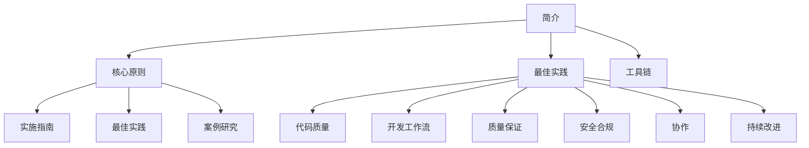

# ASDM 简介

人工智能支持的开发方法论（AI-Supported Development Methodology，ASDM）是一种综合性的软件开发方法，它利用人工智能来增强和简化开发过程。该方法论将传统软件开发实践与人工智能驱动的工具和技术相结合，以提高软件项目的效率、质量和创新能力。

## 文档结构

本文档分为三个主要部分：
- **核心原则**：ASDM的基本概念和理念
- **最佳实践**：实际实施指南和建议
- **工具链**：支持ASDM实施的工具和技术

## 主要目标

1. **提高开发效率**
   - 通过AI辅助加速开发周期
   - 减少重复任务和样板代码
   - 简化代码审查和测试流程

2. **提升代码质量**
   - 利用AI进行代码分析和优化
   - 确保一致的编码标准
   - 在开发早期识别潜在问题

3. **改进决策制定**
   - 利用AI洞察进行架构决策
   - 数据驱动的开发规划
   - 智能资源分配

## 目标用户

- 开发团队
- 项目经理
- 技术负责人
- DevOps工程师
- 质量保证团队

## 入门指南

1. **评估**
   - 评估当前开发流程
   - 确定AI集成的领域
   - 定义成功指标

2. **工具选择**
   - 选择适当的AI开发工具
   - 设置开发环境
   - 配置集成点

3. **团队培训**
   - 提供AI工具培训
   - 建立最佳实践
   - 创建文档

4. **实施**
   - 从试点项目开始
   - 收集反馈
   - 迭代和改进

## 优势

- 更快的开发周期
- 减少技术债务
- 提高代码可维护性
- 增强开发者体验
- 更好的项目成果

## 下一步

1. 查看ASDM的[核心原则](core-principles.md)
2. 探索实施的[最佳实践](best-practices.md)
3. 按照[实施指南](implementation-guide.md)开始使用